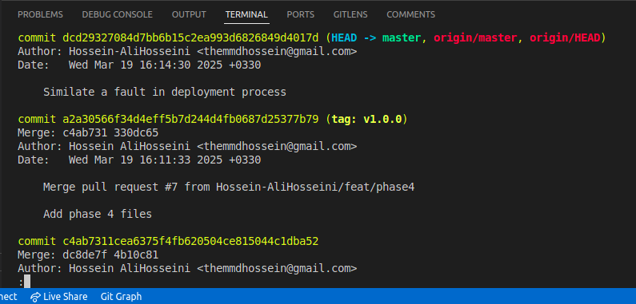
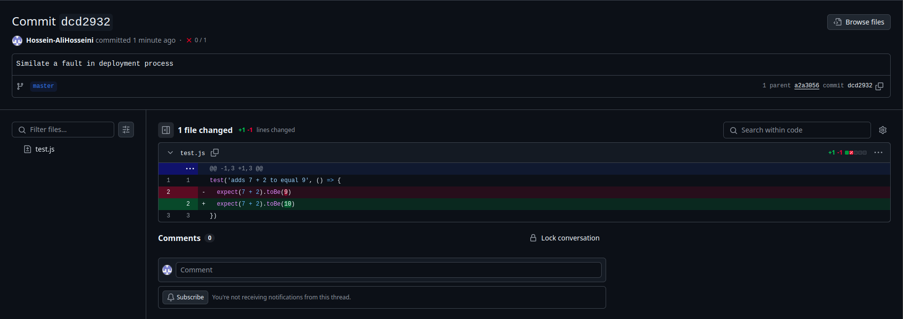
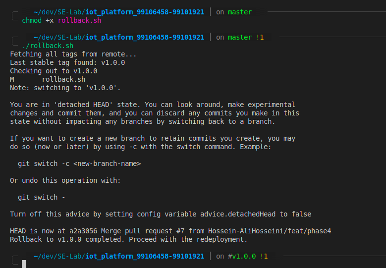
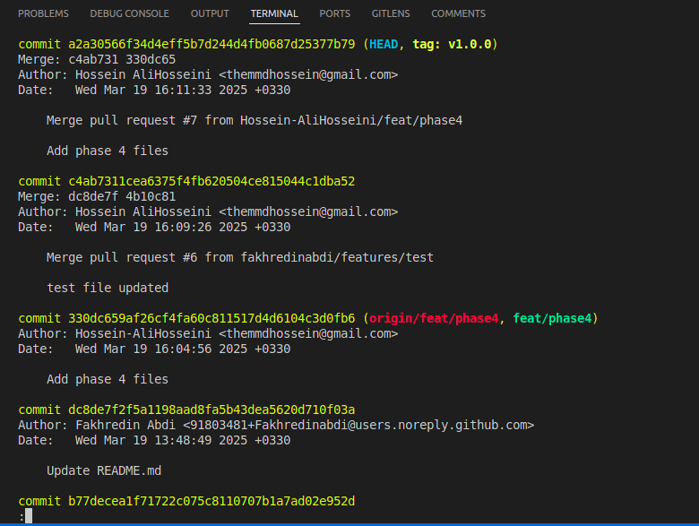

# Deployment Failure Simulation Report

## Introduction
This report documents the simulation of a controlled deployment failure and the subsequent execution of our rollback strategy.

## Test Details
- **Scenario**: Introduction of a syntactical error in the JS code.
- **Commit ID**: dcd29327084d7bb6b15c2ea993d6826849d4017d
- **Error Description**: 7 + 2 is not equal to 10!

## Rollback Execution
- **Rollback Script Used**: `rollback.sh`
- **Outcome**: Successful rollback to the previous stable version.

